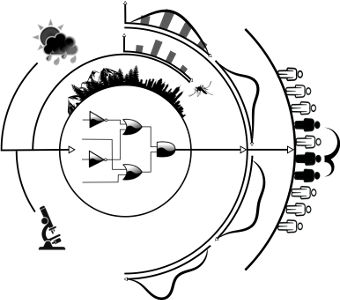

# sPop2: a dynamically-structured matrix population model

<p align="center">

</p>

This is the standalone C library of the dynamically-structured matrix population model sPop2.
This version implements both hazard-based and accumulative processes. While the method of hazards is implemented in the *spop* data structure, the method of accumulation is implemented in *spop2*.

## Installation

**Configuration**

Construct configuration and Makefiles

```bash
./configure
```

**Compiling / linking**

Compile and install the library to the OS defaults (`/usr/local/lib` and `/usr/local/include`)

```bash
make
sudo make install
```

## Using the library

Include the created library in your project.

**C code snippet**

Please see <a href="docs/examples/">docs/examples</a> for further documentation and usage examples.
The following is an excerpt from <a href="docs/examples/ex1_simple">ex1_simple</a>.

```c
#include "spop2/spop2.h"
// ...
spop pop = spop_init(0, MODE_GAMMA_HASH);
spop_add(pop, 0, 0, 0, 1000);
spop_iterate(pop,
             0, 10, 5, 0,
             0.25, 0, 0, 0,
             0);
spop_print(pop);
spop_destroy(&pop);
```

**Compile and run**

```bash
$ gcc -Wall -lm -lspop2 -lgsl -o ex1_simple ex1_simple.c
```

## Removing Clutter

You have to become root to cleanup, because `sudo make install` generates `src/.libs/*`.

```bash
sudo make clean
```

## Uninstalling Library

```bash
sudo make uninstall
```
